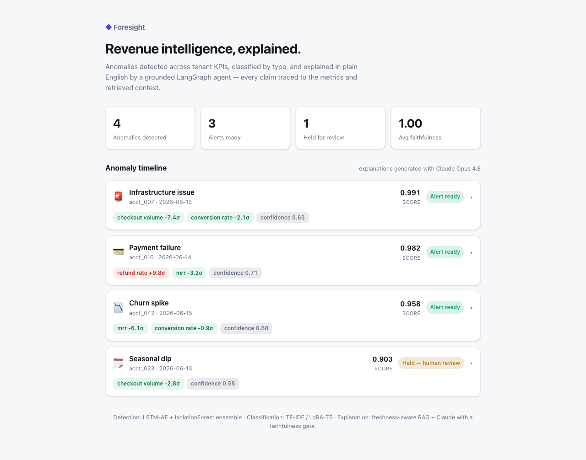

# Foresight — Frontend (M5)

Next.js 15 dashboard: the anomaly timeline with AI explanations — the URL you
send someone.



## What it shows

- **Stat tiles**: anomalies detected, alerts ready, held for review, average
  faithfulness.
- **Anomaly timeline**: each anomaly card shows type, tenant, date, detection
  score, the driving metrics (signed σ chips), and the alert status
  (`ready` / `held — human review` / `held — low faithfulness`). Click a card to
  expand the grounded AI explanation, its faithfulness bar, and the retrieved
  sources.
- Theme-aware (light/dark), mobile-responsive.

## The data is real

`public/demo-data.json` is generated by running representative anomalies through
the **real agent** — including live Claude explanations and the faithfulness
gate — via `agent/foresight_agent/gen_demo_bundle.py`. The three `ready` alerts
carry genuine Claude Opus 4.8 output; the low-confidence seasonal dip is honestly
withheld for review. Precomputing the bundle keeps the page a static, instant
load with no API calls (deployable to any static host).

Regenerate the bundle:

```bash
cd agent && source .venv/bin/activate
python -m foresight_agent.gen_demo_bundle --out ../frontend/public/demo-data.json
```

## Run it

```bash
cd frontend
npm install
npm run dev        # http://localhost:3000
npm test           # Vitest component tests
npm run build      # static production build
```

## Scope

This is the read-only dashboard slice of M5. The live WebSocket metric stream,
AI chat ("why did my MRR drop last Tuesday?"), connector OAuth setup, and alert
configuration are the remaining M5 pieces — they need the M4 backend to serve
live data.
